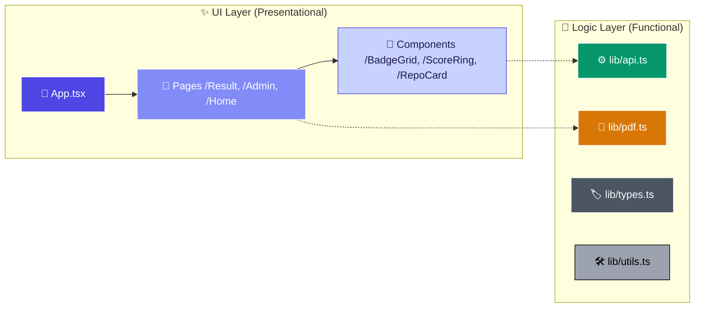
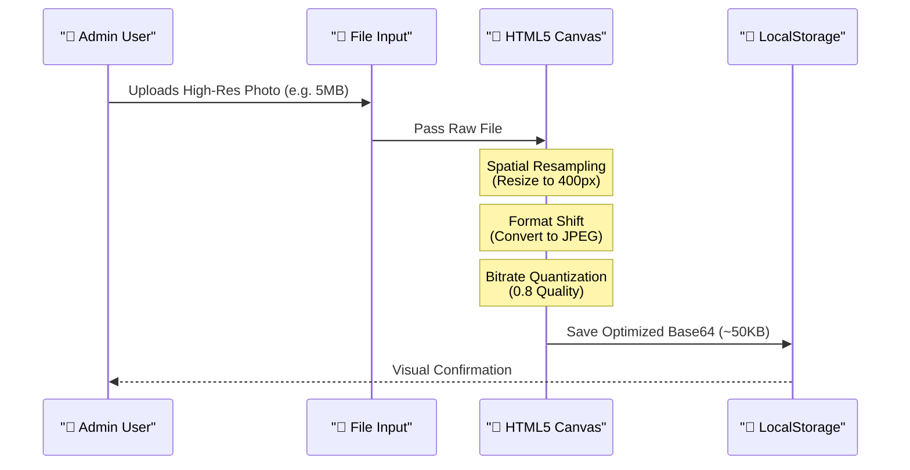

# 🏗️ System Architecture — GitInsight AI

GitInsight AI is engineered as a high-performance, client-side heavy Single Page Application (SPA). It prioritizes **data privacy**, **premium aesthetics**, and **local storage optimization**.

---

## 1. 🌐 Global Data Flow

This diagram illustrates how data travels from the GitHub API through our logic engines to the final UI.

```mermaid
graph TD
    %% Node Definitions
    User(( "👤 Developer" ))
    Frontend["Vite + React SPA"]
    GitHubAPI["🌐 GitHub REST API"]
    DataProcessor["⚙️ lib/api.ts"]
    ScoreEngine["🔢 Scoring Engine"]
    AI_Model["🤖 AI Analysis Model"]
    UI["✨ Result Dashboard"]
    PDF["📄 PDF Export Engine"]

    %% Flow
    User -->|Username| Frontend
    Frontend -->|GET Request| GitHubAPI
    GitHubAPI -->|JSON Payload| DataProcessor
    DataProcessor -->|Refined Stats| ScoreEngine
    DataProcessor -->|Contextual Data| AI_Model
    ScoreEngine -->|Calculated Score| UI
    AI_Model -->|Natural Language Insights| UI
    UI -->|Vector Rendering| PDF

    %% Styling
    style User fill:#f97316,stroke:#fff,stroke-width:2px,color:#fff
    style Frontend fill:#6366f1,stroke:#fff,stroke-width:2px,color:#fff
    style GitHubAPI fill:#1e293b,stroke:#fff,stroke-width:2px,color:#fff
    style DataProcessor fill:#475569,stroke:#fff,stroke-width:1px,color:#fff
    style ScoreEngine fill:#10b981,stroke:#fff,stroke-width:1px,color:#fff
    style AI_Model fill:#8b5cf6,stroke:#fff,stroke-width:1px,color:#fff
    style UI fill:#ec4899,stroke:#fff,stroke-width:2px,color:#fff
    style PDF fill:#64748b,stroke:#fff,stroke-width:1px,color:#fff
```

---

## 2. 📁 Operational Component Hierarchy

The application follows a modular structure where UI components are decoupled from the core business logic.



---

## 3. 🖼️ Image Optimization Logic (Commander Terminal)

To manage the **5MB LocalStorage limit** while allowing professional avatars, we use a sophisticated compression pipeline:



### 🛠️ Optimization Specs:
- **Spatial**: Max dimension fixed at `400px`.
- **Format**: Forced `image/jpeg` to eliminate PNG alpha-channel overhead.
- **Bitrate**: `80%` quality (indistinguishable from 100% for avatars).
- **Result**: Up to **99% reduction** in storage footprint.

---
<p align="center">
  <i>Created by <b>Babin Bid</b> — GitInsight AI Engineering</i>
</p>
