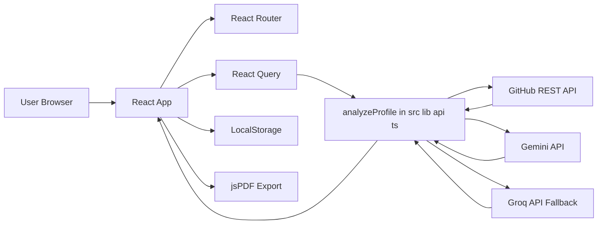
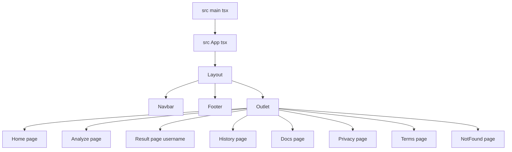
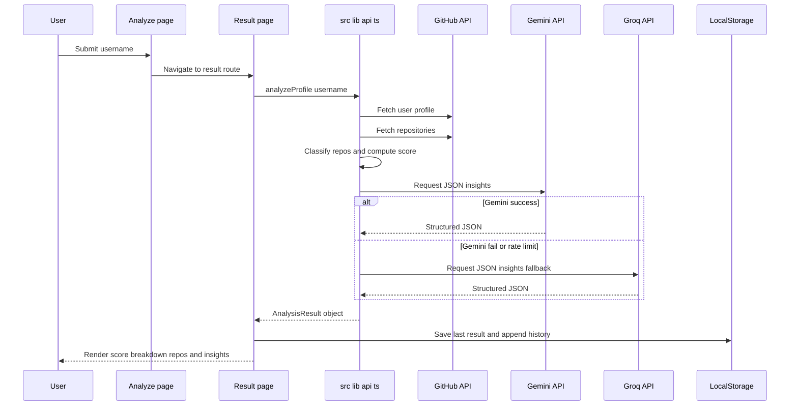
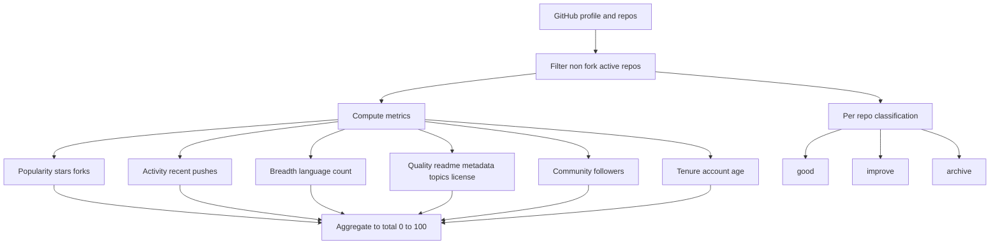
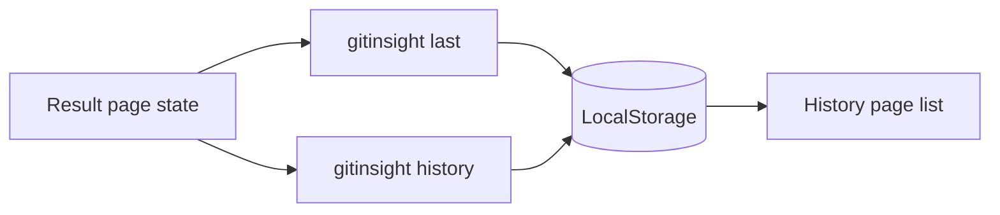
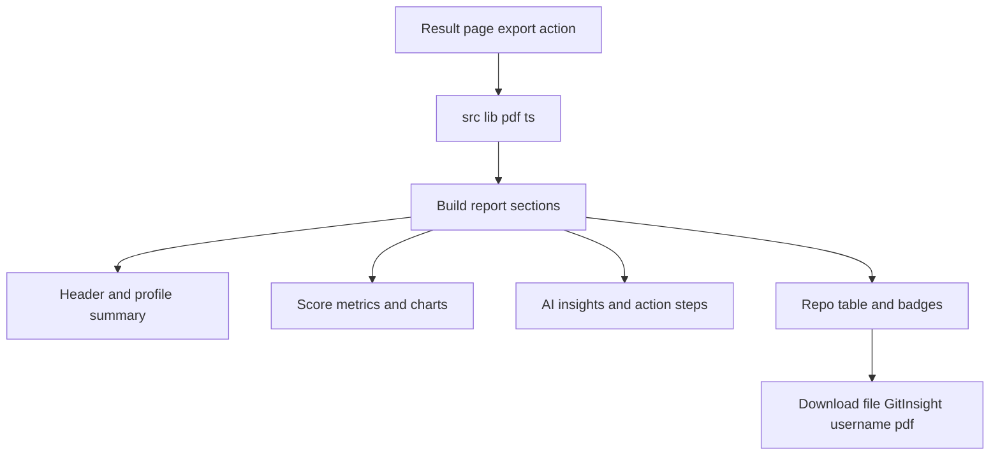
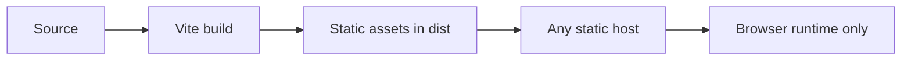

# 🏗️ Architecture GitInsight AI

GitInsight AI is a client side React application that analyzes a GitHub profile, calculates a deterministic score, enriches the result with AI generated insights, stores local history, and exports a PDF report.

## 🌐 System Topology

## 🧭 Route Architecture

## 🔄 Analyze Pipeline End to End

## 📊 Scoring And Classification Logic

## 🧩 Data Contracts

`src/lib/types.ts` defines the shared contracts used across the app.

1. `AnalyzedUser`: normalized profile model used by UI.
2. `AnalyzedRepo`: repository metadata and classification.
3. `AnalysisResult`: full payload returned by `analyzeProfile`.
4. `AiInsights`: strict shape expected from Gemini or Groq JSON.

## 💾 State And Persistence

1. Last analyzed profile is stored for quick revisit.
2. History list is append only with deduping by login where needed.
3. No backend database is used.

## 📄 PDF Export Flow

## 🔐 Security Model

1. API tokens are read from `import.meta.env` with `APP_` prefixed keys.
2. `.env` is ignored by git and `.env.example` is tracked as template.
3. Since this is a client side app, tokens loaded into the browser are not fully secret.
4. For stricter security move API calls to a backend and keep keys server side.

## 🛟 Resilience And Failure Handling

1. Username input is validated before network calls.
2. GitHub API errors are surfaced with status details.
3. Gemini fallback to Groq improves completion reliability.
4. If both AI providers fail, deterministic score and repo analytics still render.

## 🚀 Deployment Shape

This project is licensed under the MIT License in `LICENSE.md`.
