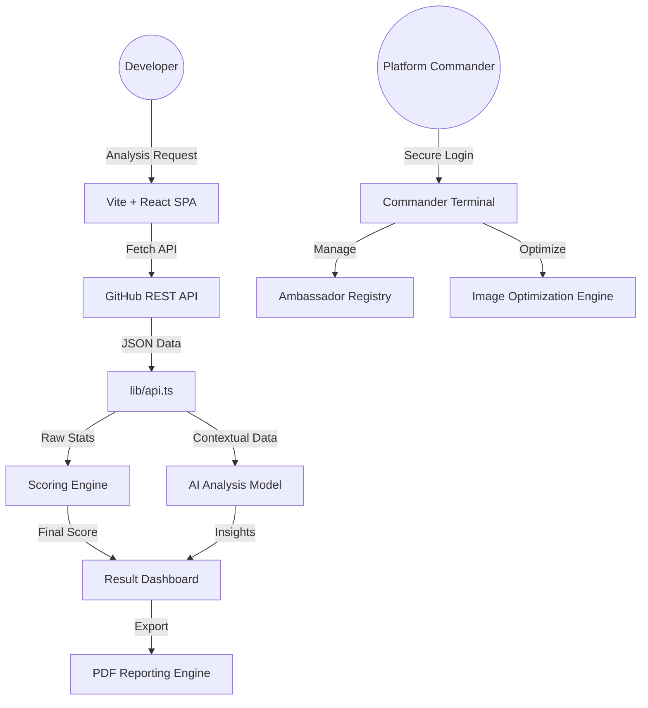

# System Architecture — GitInsight AI

GitInsight AI is designed as a high-performance, client-side heavy web application. It prioritizes data privacy, premium aesthetics (Glassmorphism), and efficient local storage management.

## 1. High-Level System Flow

## 2. Advanced Component Systems

- **Glassmorphism UI**: Uses a custom `glass-card` utility for premium depth and transparency.
- **Dynamic Terminology**: The platform dynamically maps all project entities to "Repositories" to align with professional industry standards.
- **State Management**: Orchestrated via React hooks with strategic `localStorage` persistence for results, history, and admin profiles.

## 3. Storage & Performance Optimization

### Triple-Layer Image Compression
To stay within the 5MB `localStorage` limit while allowing high-resolution admin uploads, the platform utilizes:
1.  **Spatial Resampling**: Downscales all uploads to a maximum dimension of `400px` using HTML5 Canvas.
2.  **Format Transformation**: Automatically converts heavy formats (PNG, RAW) into lightweight `image/jpeg`.
3.  **Quality Quantization**: Applies a `0.8` quality factor during export, reducing file size by up to 95% without visible loss in fidelity.

### Reporting Engine
The `lib/pdf.ts` module handles the generation of professional Audit Reports. It utilizes custom vector drawing (stars, forks) and multi-layered typography to present complex engineering metrics in a clear, recruiters-ready format.

## 4. Data Persistence Model

- **Analysis Results**: Cached using a dual `memory + storage` approach.
- **Ambassador Registry**: A persistent list of top contributors synchronized via local state.
- **History Console**: A full operational log of all analyzed profiles, accessible through the Admin Terminal.

---
*Created by Babin Bid — GitInsight AI Engineering*
