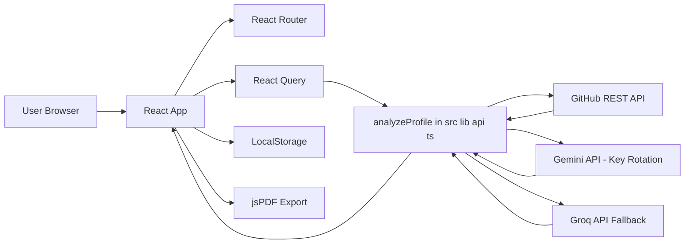
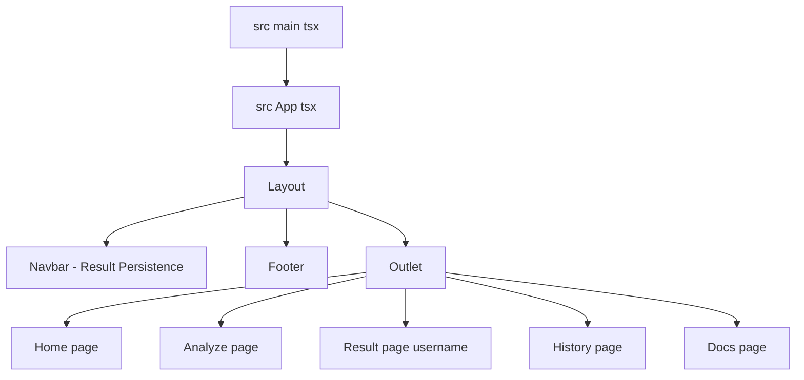
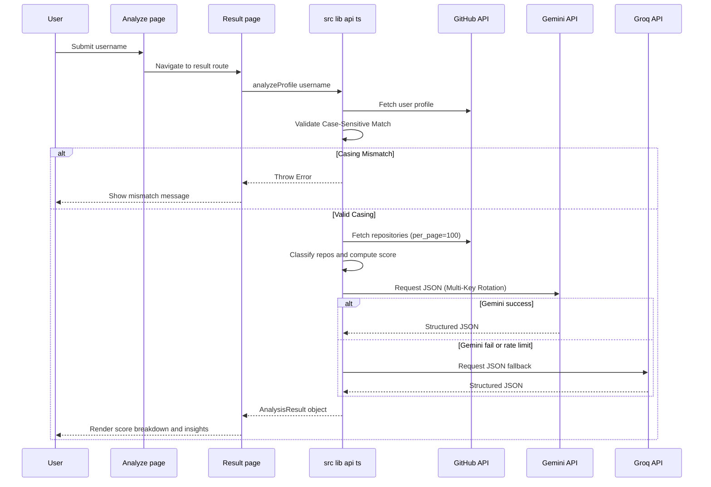

# 🏗️ Architecture GitInsight AI

GitInsight AI is a client-side React application that analyzes a GitHub profile, calculates a deterministic score, enriches the result with AI-generated insights, stores local history, and exports a PDF report.

## 🌐 System Topology

## 🧭 Route Architecture

## 🔄 Analyze Pipeline End-to-End

## 📊 Scoring And Classification Logic

The system uses a 0–100 deterministic scoring engine based on:
1. **Popularity**: Stars and forks (including forked repos).
2. **Activity**: Recent push dates (< 90 days).
3. **Breadth**: Unique primary language count.
4. **Quality**: README presence, topics, metadata, and licensing.
5. **Community**: Followers and engagement.
6. **Tenure**: Account age in years.

## 💾 State And Persistence

1. **Analysis Memory**: The application remembers the last successfully analyzed user. Navigating away (e.g. to Docs) and back to "Analyze" preserves the result.
2. **Reset Logic**: Navigating to the Home page via the logo or Home link clears the persistence state for a fresh start.
3. **History**: Results are appended to a local history list for quick access.

## 📄 PDF Export Flow

Uses `jsPDF` to generate a high-fidelity, color-themed report including:
- Profile summary and avatar.
- Score dimension bar charts.
- Detailed AI strengths/weaknesses.
- Repository classification table and badges.

## 🔐 Security Model

1. API tokens are read from `import.meta.env` with the custom `APP_` prefix configured in Vite.
2. The system supports up to **3 Gemini API keys** to distribute traffic and prevent rate limiting during high-volume hackathon usage.

## 🛟 Resilience And Failure Handling

- **Strict Validation**: Invalid formats or casing mismatches are caught early.
- **Provider Fallback**: Gemini errors trigger an immediate Groq fallback attempt.
- **Cache Busting**: "Refresh" actions use timestamp parameters to ensure fresh GitHub data.

---
© 2026 GitInsight AI · Developed by Babin Bid for AICore Connect Hackathon.
