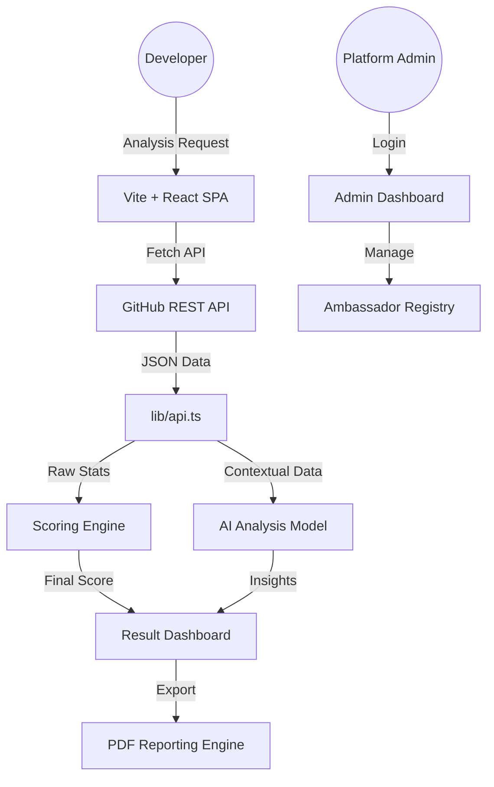

# System Architecture — GitInsight AI

GitInsight AI is built as a high-performance, client-side heavy web application with a focus on premium aesthetics and responsive data visualization.

## 1. High-Level Flow

## 2. Component Hierarchy

- **Main Application**: React with `react-router-dom` for seamless navigation.
- **State Management**: Localized state with persistent `localStorage` for analysis history and admin sessions.
- **UI System**:
    - **Radix UI**: Accessible primitives (Tabs, Tooltips).
    - **Framer Motion**: Smooth, high-fidelity animations and transitions.
    - **Tailwind CSS**: Premium design system with dark/light mode tokens.
- **Core Modules**:
    - `api.ts`: Central hub for data fetching, scoring, and registry management.
    - `pdf.ts`: Client-side PDF generation with `jsPDF` and `jspdf-autotable`.

## 3. Data Persistence Model

The platform uses a layered persistence strategy:
- **Active Result**: Cached in memory and URL state.
- **History Console**: Stored in `gitinsight:history` within LocalStorage.
- **Ambassador Registry**: Synchronized global registry of analyzed profiles.
- **Admin Session**: Encrypted-style authentication tokens in local session storage.

---
*Created by Babin Bid — GitInsight AI Engineering*
