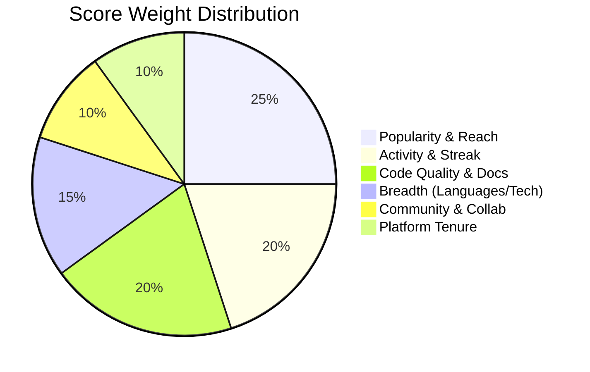

# Core Logic — GitInsight AI

GitInsight AI operates on a sophisticated scoring and analysis pipeline designed to quantify developer impact and provide actionable growth paths.

## 1. Analysis Pipeline

The system utilizes a multi-stage analysis process:

1. **Data Ingestion**: Fetching user profile, repository statistics, languages, and contribution history from the GitHub API.
2. **Metric Aggregation**: 
   - **Popularity**: Sum of stars, forks, and follower velocity.
   - **Activity**: Commit frequency, streak maintenance, and recent contributions.
   - **Quality**: Repository documentation (README), licensing, and topic coverage.
3. **AI Evaluation**: Passing curated metrics to the AI engine to generate:
   - Recruiter-focused insights.
   - Strengths and weaknesses analysis.
   - Project improvement tips.
   - Custom project ideas based on tech stack.

## 2. Scoring System (0-100)

The "GitInsight Score" is calculated using a weighted algorithm:

## 3. Ambassador XP & Gamification

To encourage growth, the platform tracks "Ambassador Progress":

- **XP Calculation**: Derived from the overall profile score multiplied by activity multipliers.
- **Streak Multiplier**: Consecutive days of activity boost XP gains.
- **Badge System**: 10 unique achievements triggered by specific GitHub milestones.

## 4. Administrative Terminal

The `/admin` portal allows platform managers to monitor the ecosystem:

- **Registry**: Real-time leaderboard of the top 10 ambassadors by XP.
- **Search Analytics**: Access to historic analysis data for community trend monitoring.
- **Profile Persistence**: Secure administrative authentication with local session management.

---
*Created by Babin Bid — GitInsight AI Engineering*
